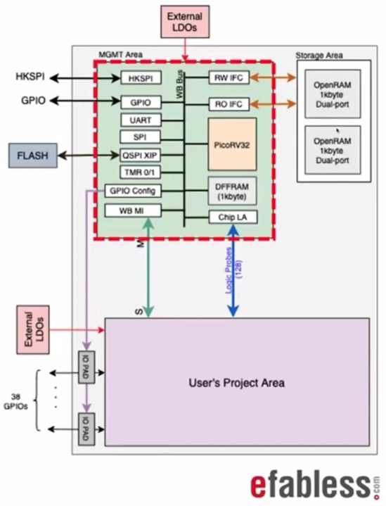

# PHASE-LOCKED LOOP IC DESIGN USING SKY130 PDK

# DESCRIPTION:  
In the current era of information, analog domain has become a challenging and an important part of IC design. Almost all electronic systems are susceptible to noise and mismatch. PLL is a an important element that is found in radio, telecommunications, oscillators among others. In this regard, a 2-day workshop on Phase-Locked Loop (PLL) IC design by VSD-IAT was conducted from 31st July, 2021 to 1st August, 2021. The workshop covered the basic understanding of all the different blocks that make up a PLL. Using open-source tools such as Ngspice, Magic and Google-Skywater 130nm PDK; a 8x PLL clock multiplier IC was designed. Both pre-layout and post-layout simulations were carried out and detailed analysis was done to get an intuitive understanding of VLSI design flow (starts from device level to tapeout stage). For the tapeout stage, the latest Caravel SoC template was used to make the IP ready for fabrication.  Basic understanding of electric circuits is beneficial for a beginner.

# CONTENTS:
- [Day 1](#day-1):  
  - [PLL Theory](#pll-theory)  
  - [Phase-Frequency Detector (PFD)](#phase-frequency-detector-pfd)  
  - [Charge Pump (CP)](#charge-pump-cp)  
  - [Loop Filter](#loop-filter)  
  - [Voltage Controlled Oscillator (VCO)](#voltage-controlled-oscillator-vco)  
  - [Frequency Divider (FD)](#frequency-divider-fd)  
  - [Terminologies in PLL](#terminologies-in-pll)
  - [Tool Setup](#tool-setup)  
  - [Development Flow](#development-flow)  
  - [PLL Specifications](#pll-specifications)  
- [Day 2: Simulations](#day-2-simulations):  
  - [Pre-Layout Simulations](#pre-layout-simulations)  
    - [Phase-Frequency Detector (PFD)](#phase-frequency-detector-pfd-1)  
    - [Charge Pump (CP)](#charge-pump-cp-1)  
    - [Voltage Controlled Oscillator (VCO)](#voltage-controlled-oscillator-vco-1)  
    - [Frequency Divider (FD)](#frequency-divider-fd-1)  
    - [PLL System](#pll-system)
    - [Troubleshooting Steps](#troubleshooting-steps)  
  - [Layout Design](#layout-design)  
    - [Phase-Frequency Detector (PFD)](#phase-frequency-detector-pfd-2)  
    - [Charge Pump (CP)](#charge-pump-cp-2)  
    - [Voltage Controlled Oscillator (VCO)](#voltage-controlled-oscillator-vco-2)  
    - [Frequency Divider (FD)](#frequency-divider-fd-2)  
    - [MUX](#mux)  
    - [PLL System](#pll-system)  
  - [Post-Layout Simulations](#post-layout-simulations)  
    - [Phase-Frequency Detector (PFD)](#phase-frequency-detector-pfd-3)  
    - [Charge Pump (CP)](#charge-pump-cp-3)  
    - [Voltage Controlled Oscillator (VCO)](#voltage-controlled-oscillator-vco-3)  
    - [Frequency Divider (FD)](#frequency-divider-fd-3)  
    - [PLL System](#pll-system)  
  - [Tapeout](#tapeout)  
- [Summary](#summary)  
- [Acknowledgement](#acknowledgement)  
  

# Day 1:  
## PLL Theory:  
A phase-locked loop (PLL) is a control system that compares the phase of input reference signal and output desired signal through a feedback loop. The goal of PLL system is to generate a very precise clock signal without frequency fluctuations or phase noise and at the same time have the flexibility of running at the desired frequency. The output gets "locked" with the input reference signal, when the phase difference between the two signal is 0. This means the output mimics the reference to have the same or a multiple of the reference signal frequency and a constant phase difference with it.  

The basic block diagram of PLL system is shown below:  

Usually, to generate clock signal, either Quartz crystals or Voltage-controlled oscillators (VCOs) is used depending on the application. VCOs offer good flexibility and better control frequency with input voltage. They are mostly used for on-chip applications. However, they are susceptible to noise and/or fluctuations in their phase. This is refered to as Phase noise. On the other hand, Quartz crystals provide superior spectral purity and no unwanted frequency.

Note: Spectral purity refers to a frequency spectrum having least amount of unwanted frequencies.  

    

We shall now look into each block of the PLL system and understand its functionality:

## Phase-Frequency Detector (PFD):  
It is used to to compare the frequency divided by 8 signal and the reference input signal. Using XOR function, one cannot distinguish between leading and lagging nature of input or output. To this extent, one introduces 2 additional signals: UP and DOWN that tell when the output signal needs to be sped up or slowed down respectively. Also, the width of output signal pulse tells to what extent the phase difference needs to be increased or decreased.  

From the figure above, The DOWN signal becomes ACTIVE when falling edge of output is detected till falling edge of reference signal. Similarly, the UP signal is detected when falling edge of reference signal is detected till falling edge of output signal. 

Similarly, for signals of different frequency, if the output signal frequency is higher than the reference signal, DOWN signal is ACTIVE. This indicates that we must slow down the output. Likewise, if the output signal frequency is lower, UP signal becomes ACTIVE. Hence, we must speed up the output. In this way, these 2 signals (UP and DOWN) help capture the frequency/phase difference between the reference and the output. This is also shown below in the form of a state diagram:

To implement PFD, since we have to detect falling edges of two different signals, one uses 2 edge-triggered flip-flops as shown below. Moreover from the understanding established above in regards to UP and DOWN signals, one would require AND gate as well.

However, one main issue with above configuration is the presence of Dead zone. It refers to the smallest difference in phase or frequency that the PFD is able to measure accurately without affecting the stability of the system. Any logic gate implemented in real life will have some delay associate with it. This delay makes the presence of dead zone inevitable for PFD block.

## Charge Pump (CP):
The role of a charge pump in PLL is to convert the difference in phase/frequency measured digitally into an analog signal that can be used to control the voltage-controlled oscillator (VCO). This is achieved using current steering circuit. This circuit steers/directs the current flow from supply to output or output to ground depending on the UP and DOWN signal that is provided. The charge pump circuit gives an output voltage which corresponds to the average active time of UP and DOWN signals.

One main issue with the above transistor level design is that when the up and down transistors are OFF (Mpcsr and Mncsr), there is still some current flowing through them in form of leakage which may continue to charge the load capacitor. This is referred to as charge leakage. To tackle this issue, an additional set of transistors are added at the output side as shown below:

    

## Loop Filter:
Recall, the output capacitor of the CP circuit helps smoothens the output. However, there are still fluctuations caused due to rise and fall of UP and DOWN signals. To mitigate this, one may use a low-pass filter (LPF) at the output instead of just a capacitor. This smoothens out any high-frequency fluctuations in the output. It also helps in stabilizing the PLL system. Recall, a loop filter is same as adding a zero to the frequency domain of the PLL which enable the system to be stable. Without LPF, the PLL cannot lock and mimic the reference signal.  

    

To ensure stability of system, the designer chooses the values of resistors and capacitors as per a thumb rule mentioned above where the highest output frequency is the desired frequency to give for a PLL.

## Voltage Controlled Oscillator (VCO):
A series combination of odd number of inverters is used to make a ring oscillator. This offers an output whose period is twice the total delay of all the inverters. However, to make it flexible, a current starving mechanism is used to control the oscillating frequency. Two current sources are used as supplies for the ring oscillator. This enable the control on its frequency based on an input-controlled voltage. The VCO is to be designed such that the range of output frequencies we want for the PLL is within the range of frequencies that this VCO can produce properly. To get a full output swing, one may put an extra inverter at the output.

    

## Frequency Divider (FD):
The output of a Toggle flip-flop (TFF) will be half the frequency of the input. TFF is implemented using DFF (Delay flip-flop) as shown in Fig.(a).  

The circuit implemented in Fig.(a) can be implemented again using 4 inverters and 2 transmission gates (Fig.(b)). The set of inverters and tranmission gates in series is forming a simplified DFF. Fig.(c) and Fig.(d) represent the clock and desired output waveforms. Here, the faded green signal represents the input reference signal.  
To implement a 8x clock multiplier, we can add 3 TFFs to get the desired result.

Before proceeding with tool setup, we need to address some important terms associated with PLL.  

## Terminologies in PLL:
1) Lock Range: The range of frequencies the PLL is able to follow input frequency variations once locked. It is mainly defined by the range of frequencies VCO can produce and is limited by the dead zone of the PFD block.
2) Capture Range: It refers to the range of frequencies for which the PLL is able to lock-in when starting from an unlocked condition. This is usually smaller than the lock range and depends on the loop filter bandwidth.
3) Settling Time: It is the time within which the PLL is able to lock-in from an unlocked condition. This depends on how quickly the charge pump rises to a stable value.

## Tool Setup:
Following open-source tools were needed for PLL IC design:
1) Ngspice- for transistor level spice simulations
2) Magic- for layout design and parasitic extraction
3) Google-Skywater 130nm PDK- for primitive libraries of the transistors to be used during simulations using Ngspice
4) Caravel- a medium to ensure that the designed IP is tapeout ready

Note: A PDK (process-development kit) is a collection of libraries, standard cells and other files which are required for desiging an IC.

To install:  
1) Ngspice-> sudo apt-get install ngspice (from here we fetch Sky130nm libraries that contains transistor level information). Alternatively, one can git clone the source code from an existing repository.  

2) Magic-> We need to git clone the source code from opendesigncircuit.com (to ensure proper integration of tool with Skywater130nm PDK). The file needed for magic tool is sky130A.tech. Then we install the dependencies followed by Magic tool. The following commands are used for this process:  
   - sudo apt-get update && sudo apt-get upgrade  
   - git clone git://opencircuitdesign.com/magic  
   - sudo apt-get install csh  
   - cd magic  
   - ./configure  
   - make  
   - sudo make install  

Note: In this workshop, we are using preuploaded tech file for magic tool.  

To use/run a circuit file using:  
1) Ngspice-> ngsice <circuit_file_name>  
It directly simulates the circuit file and plots the required results.  
2) Magic-> magic -T <Technology_file_from_PDK> <the_layout_file_to_open>  
Using this, one gets to open the layout file which can be used to modify the circuit layout. In addition to designing layout, other features are also explored such as parasitic extraction and gds write features.

## Development Flow:
The process in which the PLL IC is developed consists of a sequence of steps as follows:  

1) SPICE-level circuit development (based on PLL specifications requirements)
2) Pre-layout simulation
3) Layout development (provides the width of the interconnections, size of different parts of the circuit, etc.)
4) Parasitic extraction (to extract the capacitive effects caused by the interconnects, etc. to generate a SPICE Netlist.)
5) Post-layout simulation (more accurate result than pre-layout simulations)

It is often the case that after each step, one needs to make necessary modifications to the circuit to bring it closer to the required PLL specifications.

## PLL Specifications:
As discussed above, before we start with designing circuits, it is necessary to list the specifications for the PLL systems. The specifications gives the operating conditions at which the PLL is to operate.

1) Corner- 'TT' (Typical-Typical)
2) Supply voltage= 1.8 V
3) Room temperature
4) VCO mode and PLL mode
5) Input frequency range- Fmin= 5MHz , Fmax= 12.5MHz
6) Clock Multiplier = 8x
7) Jitter (RMS) < ~20ns (measure of phase noise)
8) Duty cycle ~ 50%  

Note: In above, TT process represents the nominal case where the concentration of the doping (in pmos and nmos) turned out just right.  

# Day 2: Simulations
To get started with simulations, it is necessary to create a SPICE file. It is a text file with .cir extension. We will create SPICE files for each of the building blocks of PLL system before proceeding with simulations.

## Pre-Layout Simulations:
To run pre-layout simulations the command is:  
ngspice <file_name>.cir  

### Phase-Frequency Detector (PFD):

In above graph, the different colors represent:  
Clock 1-> red  
Clock 2-> blue  
UP Signal-> orange  
DOWN Signal-> green

### Charge Pump (CP):
The output of the CP block when UP signal is ACTIVE (= '1'):  

The graph below shows the rise in output due to charge leakage:  

The slope is 40 V/s. It indicates that in every 1us, the output capacitor gets charged by 40uV.

### Voltage Controlled Oscillator (VCO):

Here, the control voltage is represented by red color while output clock is shown by blue color.  

### Frequency Divider (FD):

Here, input clock is shown in blue and output clock is shown in red color.  

### PLL System:
Here, we have shown simulations for 2 cases for a 8x clock multiplier PLL system:  

1) When input frequency is 5MHz, then output frequency is 40MHz:   

2) When input frequency is 12.5MHz, then output frequency is 100MHz:  

In both the above cases, the color terminology used is:  
Input reference-> red  
Output frequency divided by 8 clock-> blue  
UP signal-> brown  
DOWN signal-> yellow  
Charge-pump output-> purple  

### Troubleshooting Steps:  
Usually, it so happens that the output doesn't properly lock (or mimic the input reference) due to some errors in circuit designing. In such a case, following sequence of steps are usually followed:  

- Identify the issues that might be occurring in the simulations or circuit.
- Try to debug individual components and confirm their functionality before simulating the entire circuit.  
- If the waveforms are flat or simulation is crashing, then:  
  - Check whether all connectivities have been done properly.  
  - Check the spelling of each net, model name, case-sensitive issues, parameter value assignment.  
  - Check if any pin is left unconnected.  
- In case of correct waveforms but improper mimicking, then:  
  - Find the range of frequencies for which VCO is working properly. The required output frequency range should lie within VCOs frequency range.  
  - Check if the PFD block is able to detect minute (small) changes in the phase difference properly; else it may lead to phase noise in the system. This may cause the PLL system to become unstable.  
  - Rate at which the output of charge-pump block is charging/discharging. In case of fluctuations in the output voltage, one may need to re-size the transistors appropriately to get a smooth response.  
  - Check whether output is charging in case of no input (i.e. input is 0). If yes, then charge leakage is the main issue.  
  - Adjust the loop filter values (while ensuring the stability of the system) to get desired response.  

## Layout Design:
To design/modify the layout of different blocks, the command is:  
magic -T <Technology_file_from_PDK> <the_layout_file_to_open>  

Color Specifications used:
1) p-diffusion -> orange  
2) n-diffusion -> green  
3) Polysilicon -> red  
4) n-well -> dashed lines  
5) Metal1 layer -> purple  
6) Local interconnect layer -> blue

While making connections, we use via to connect different metal layers (through overlap) and and interconnect layer between two transistors. To calculate the area of a layout design, select the entire rectangular layout (Press "I") and type keyword "box" in the magic tool command window.  
We shall now look at the layouts of the different blocks of PLL system.  

### Phase-Frequency Detector (PFD):

Area is ~ 51um (square units)  

### Charge Pump (CP):

Area is ~ 132.35um (square units)  

### Voltage Controlled Oscillator (VCO):

Area is ~ 57.8um (square units)  

### Frequency Divider (FD):

Area is ~ 49.15um (square units)  

### MUX:

Area is ~ 12.2um (square units)  

### PLL System:
A block level view of the layout is shown below:  

Layout of the entire system is shown below:  

Area is ~ 496.2um (square units)  

## Post-Layout Simulations:
To run post-layout simulations, the command is:  
ngspice <file_name>.cir  
Example: ngspice PFD_PostLay.cir  
Here, we conduct post-layout simulations for all the blocks of PLL system.

### Phase-Frequency Detector (PFD):

Below waveforms represent the case when UP signal is ACTIVE:  

Whereas, below is the case, when DOWN signal is ACTIVE:

In both above cases, color terminology used is:  
Clock 1-> red  
Clock 2-> blue  
UP signal-> orange  
DOWN signal-> green  

### Charge Pump (CP):

Below is the case when UP signal is ACTIVE (= '1'):  

Below is the case when DOWN signal is ACTIVE (= '1'):  

However, recall one of the main limitations of CP is charge leakage which causes output to charge in absence of input. This is demonstrated in below waveform. On close observation, we find that the change in output voltage due to charge leakage is ~ 0.04V in 100usec.

In all the waveforms above, the color terminology is as follows:  
UP signal-> red  
DOWN signal-> blue  
Output voltage (of CP block)-> orange  

### Voltage Controlled Oscillator (VCO):

Here, red represents the output clock whereas blue represents the control voltage.  

### Frequency Divider (FD):

Here, red represents the input clock and blue represents the output clock.  

### PLL System:
Here, we have shown simulations for 2 cases for a 8x clock multiplier PLL system:  

1) When input frequency is 5MHz, then output frequency is 40MHz:   

2) When input frequency is 12.5MHz, then output frequency is 100MHz:  

In both the above cases, the color terminology used is:  
Input reference-> red  
Output frequency divided by 8 clock-> blue  
UP signal-> brown  
DOWN signal-> yellow  
Charge-pump output-> purple  

## Tapeout:
It refers to preparing the final layout design and sending it to the fab. It is also referred to as final GDS layout file. To prepare our design, additional support is required such as:  

1) I/O Pads: Since our design is in 'um' range, using wires to connect to external world is not feasible. I/O pads are used to provide a proper interface.  
2) Peripherals: For serial connectivity such as I2C, SPI, UART, etc.  
3) Memory: To store data on-chip, memory IP is used instead of memory text which take up a lot of space.  
4) Testing mechanisms: Debug mode required to ensure proper functioning of external IC.  

Some additional preparations are also required before sending final design to the fab. Considering the complexity involved in each of these additional supports, a special SoC template made by Efabless is used that helps the designer to neglect the preparations to be done. It contains all the necessary support that one needs for our design to be ready for tapeout.  

    

  
In the IC template shown above, the User's project area is the region where our layout design is placed. In a way, this acts as a vehicle that carries our design. Hence, it is called Caravel SoC. The IC shown above gets fabricated alongside our design inside it. Moreover, one need not integrate the user's project area onto the caravel.  

For the tapeout process, one first needs to download and extract the GDS file of user project area available on https://github.com/efabless under caravel_user_project_analog template. Open the GDS file using following command:  
magic -T sky130A.tech user_analog_project_wrapper_empty.gds  

The caravel user project area contains the input-output pins (fixed) along the border. The design is placed in this area and proper connections are made following which the whole project area is placed onto the caravel SoC. One must take care while making connections between different metal layers. The completed design is then sent to the fab to proceed with the tapeout.  

# SUMMARY:
In this workshop, we started with the basic understanding of the various blocks used to design a phase-locked loop (PLL) system. Circuits were designed based on established specifications to get desired response. This was followed by pre-layout simulations using ngspice to the confirm the expected results and debug the individual components in case of error. However, in doing this, we chose to neglect the effect of the interconnections (length, width, area), mismatch, etc. As such, a layout of the circuit was designed using magic tool which was followed by parasitic extractions. This generated a SPICE netlist of the entire circuit. Post-layout simulations were then carried out which gave a more accurate result for the PLL. Finally, to make the PLL IP tapeout ready, the final layout design was prepared using caravel soc template provided by efabless. The design was placed on the user's project area and connections were completed before sending it to the fab.

# ACKNOWLEDGEMENT:  
1) I would like to thank Mr. Kunal Ghosh (Co-founder VSD Corp. Pvt. Ltd.), for providing me an opportunity to partake in this workshop and help understand VLSI design flow process both theoritically and practically.
2) I would also like to thank Ms. Lakshmi S. for providing access to spice files and guidance throughout for the implementation of PLL system. 
3) Lastly, I appreciate the TAs for clarifying my doubts during lab sessions without whom this work would not have been made presentable.
